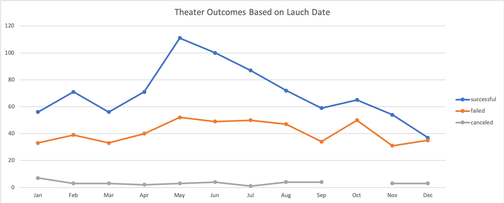
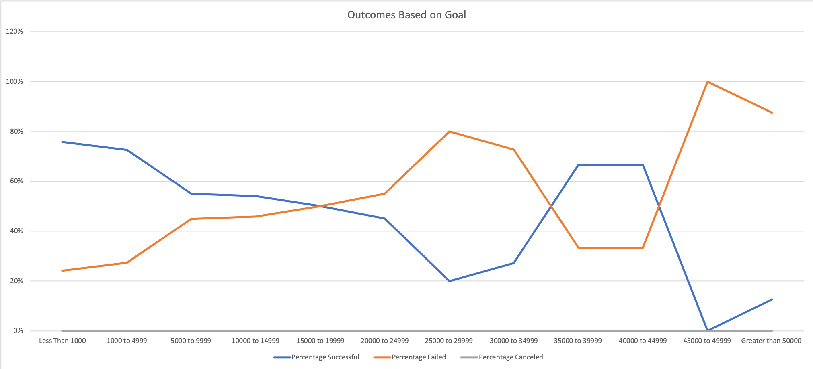

# Kickstarting with Excel

## Overview of Project
Louise is looking to see how different campaigns fared based on their correlation to their launch dates and funding goals.

### Purpose
I will be giving my findings based on the statistical analysis gathered from the Kickstarter funding data. With these findings Louise can make an informed decision to get her play 'Fever' funded in an efficient manner. 

## Analysis and Challenges
In this analysis we looked at the outcomes of theater kickstarters based on their start date below. In the line graph we show the amount of successful, failed, and canceled theater (plays, musicals, and spaces) kickstarters. 

In the second graph below we show the success rate of play kickstarters based on the funding goal. In the graph segmented the goal amount into bins $5000 not including the first bin of $0-$1000 and the last been that is greater than $5000

### Analysis of Outcomes Based on Launch Date

### Analysis of Outcomes Based on Goals

### Challenges and Difficulties Encountered
-The Analysis of Outcomes based on Launch Date is inclusive of plays, musicals, and spaces. This will give us a larger population, but may lead to more inaccurate data since Louise is looking to fundraise for a play

-Bins in the Analysis of Outcomes Based on Goals seem to be arbitrary and are not consistent increments. Small chance of error within between "$40,000-$49,000" and "greater than $50,000" if a goal happens to fall exactly on $50,000. (Not sure if this was done on purpose I made the "greater than $50,0000" bin greater than or equal to in the formula and found that it didn't change the data but wanted to make sure there were no gaps.)

## Results

- What are two conclusions you can draw about the Outcomes based on Launch Date?

 -Kickstarters were most frequently started in May being 45% higher than the mean. May also had the highest success rate at 66% with a mean of 61%. Starting a fundraising campaign in May would give a slightly higher chance of succeeding.
 
 -December is the exact opposite of May having the lowest frequency of campaigns started being 65% lower than the mean of campaigns started and having the lowest success rate of all the months at 49% with a mean success rate of 61%. December would be the worst month to start funding.

- What can you conclude about the Outcomes based on Goals?

 -There is an inverse correlation with the $ amount of the goal and the success rate of the funding. This is to be expected, the higher the goal the harder it is to raise said funds.
  
- What are some limitations of this dataset?

 -The only type of location data is “country” which is pretty broad. Was the campaign started in New York or was it started in Iowa? Depending on where Louise wanted to start her fundraising
 
  -How long it took to meet the goal for funding could have been a useful point to look at. Considering that some of the kickstarters reached over 100% before they ended there is no clear metric to show the date of when the goal was met.
  
- What are some other possible tables and/or graphs that we could create?

 -Its not clear how what the criteria for "staff picks" but showing a table of success rate of fundraiser for campaigns that are "staff picks" vs. not "staff picks" with in the "theater" category 
